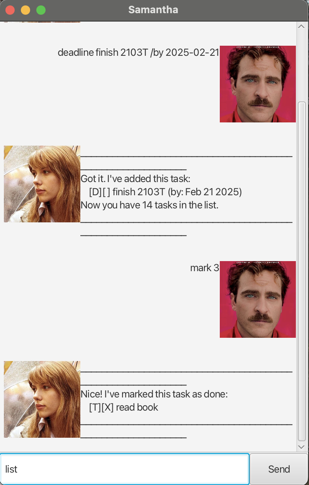

# Samantha User Guide




**This is Samantha, a Java-based chatBot to manage your personal tasks.**

## 1. Adding deadlines

Add a deadline task by its description and due date.

Example: `deadline ip /by 2025-02-21`

Expected output:
```
____________________________________________________________
Got it. I've added this task:
    [D][ ] ip (by: Feb 21 2025)
Now you have 19 tasks in the list.
____________________________________________________________
```

## 2. Adding todos

Add a todo task by its description.

Example: `todo stay hungry`

```
____________________________________________________________
Got it. I've added this task:
    [T][ ] stay hungry
Now you have 15 tasks in the list.
____________________________________________________________
```

## 3. Adding events

Add a event task by its description and time period.

Example: `event stay foolish /from 7pm /to 9pm`

Expected output:
```
____________________________________________________________
Got it. I've added this task:
    [E][ ] stay foolish (from: 7pm to: 9pm)
Now you have 17 tasks in the list.
____________________________________________________________
```

## 4. Marking tasks as done

Mark a task as done.

Example: `mark 7`

Expected output:
```
____________________________________________________________
Nice! I've marked this task as done:
    [T][X] add task 7
____________________________________________________________
```

## 5. Marking tasks as undone

Mark a task as done.

Example: `unmark 10`

Expected output:
```
____________________________________________________________
OK, I've marked this task as not done yet:
    [E][ ] project meeting (from: 2pm to: 4pm)
____________________________________________________________
```

## 6. Listing tasks 

List all the task so far.

Example: `list`

Expected output:
```
____________________________________________________________
Here are the tasks in your list:
    1. [T][X] play
    2. [D][ ] return book (by: Dec 12 2022)
    3. [T][ ] read book
    4. [T][X] write book
    5. [T][ ] sleep
    6. [T][ ] play
    7. [T][X] add task 7
    8. [T][X] ass 
    9. [T][X] play football
    10. [E][ ] project meeting (from: 2pm to: 4pm)
    11. [E][ ] project meeting (from: 2pm to: 4pm)
    12. [D][ ] return love (by: Oct 15 2033)
    13. [D][ ] return book (by: Sep 15 2025)
    14. [D][ ] finish 2103T (by: Feb 21 2025)
____________________________________________________________
```

## 7. Deleting tasks

Delete the task according to its index.

Example: `delete 1`

Expected output:
```
____________________________________________________________
OK. I've removed this task:
    [T][X] play
Now you have 19 tasks in the list.
____________________________________________________________
```

## 8. Finding tasks

Find the task according to its information.

Example: `find stay`

Expected output:
```
____________________________________________________________
Here are the matching tasks in your list:
    1. [T][ ] stay hungry
    2. [E][ ] stay foolish (from: 7pm to: 9pm)
____________________________________________________________
```

## 9. Special feature

**1. Friendlier syntax for commands.**

Examples: `l for list, m for mark, u for unmark, 
d for delete, t for todo, de for deadline, 
e for event, f for find`

**2. Type 'bye' to exit.**
